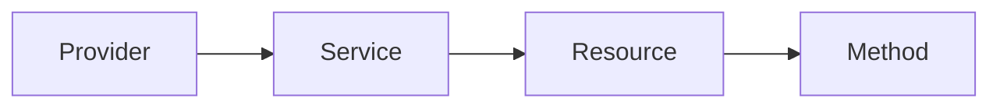

# StackQL Discovery Operations (meta queries)

<details open="open">
<summary>Contents</summary>
<ol>
<li><a href="#pulling-a-provider-from-the-registry">Pulling a provider from the registry</a></li>
<li><a href="#showing-all-services-in-a-provider">Showing all services in a provider</a></li>
<li><a href="#showing-all-resources-in-a-service">Showing all resources in a service</a></li>
<li><a href="#describe-a-resource">Describe a resource</a></li>
<li><a href="#show-all-available-methods-in-a-resource">Show all available methods in a resource</a></li>
</ol>
</details>
<br />
StackQL is built upon the provider's API specification as OpenAPI extensions which are mastered in the [__StackQL Provider Registry__](https://github.com/stackql/stackql-provider-registry); docs for each provider are available in the [__Registry Docs__](https://registry.stackql.io/).  

Meta queries, or queries that enumerate and describe the services, resources, and operations available in a provider, are available within StackQL using the [__`DESCRIBE`__](https://stackql.io/docs/language-spec/describe) and [__`SHOW`__](https://stackql.io/docs/language-spec/show) commands.  

StackQL presents a consistent ORM for every provider, which is comprised of services, resources, and methods.  The ORM is a direct reflection of the provider's underlying API.  The ORM (resource hierarchy) is shown here:  



- __Provider__: cloud, SaaS or API provider (will have its own specific authentication), for example: __`aws`__, __`google`__
- __Service__: a service endpoint or grouping of related resources, for example: __`aws.ec2`__ or __`google.storage`__
- __Resource__: an entity which has attributes and methods (the *thing* you want to query, deploy or manage), for example:  __`aws.ec2.instances`__ or __`google.storage.buckets`__
- __Method__: operations exposed on the resource by the provider, these are mapped to SQL verbs where possible such as [__`SELECT`__](https://stackql.io/docs/language-spec/select), [__`INSERT`__](https://stackql.io/docs/language-spec/insert), __`UPDATE`__, [__`DELETE`__](https://stackql.io/docs/language-spec/delete).  For lifecycle methods (non-CRUD operations) methods are accessible using the [__`EXEC`__](https://stackql.io/docs/language-spec/exec) command, for example: __`EXEC google.compute.instances.start`__

## Pulling a provider from the registry

StackQL providers can be installed or updated from the registry API, which can be accessed using the [__`REGISTRY`__](https://stackql.io/docs/language-spec/registry) commands.  For example, to list all available providers, run the following:  

```
REGISTRY LIST;
```
This command will show the latest available version for each provider.  To see all available versions for a given provider, run the following:  

```
REGISTRY LIST google;
```
To pull the latest version for a specific provider, run the following:  

```
REGISTRY PULL google;
```
> if you wanted to pull a previous version of a provider, supply the version SemVer, e.g., `REGISTRY PULL google v23.01.00104`;

The signed provider documents are downloaded to the `.stackql` directory in the current working directory.  To show all providers installed, run the following command:

```
SHOW PROVIDERS;
```

## Running meta queries

Meta queries can be run without authenticating to the provider.  Some examples are provided below:  

### Showing all services in a provider

To show all services in a provider, run the following:  

```
SHOW SERVICES IN google;
```
to filter by service name, run the following:  

```
SHOW SERVICES IN google WHERE name = 'compute';
```
to fuzzy match a service name (and return one or more matches), run the following:  

```
SHOW SERVICES IN google LIKE '%container%';
```

### Showing all resources in a service

To show all resources in a service, run the following:  

```
SHOW RESOURCES IN google.compute;
```
Filtering and fuzzy matching is also available for resources.

### Describe a resource

Once you have identified a resource you want to query, provision or manipulate, you can run the following:

```
DESCRIBE google.compute.instances;
```
This will return fields in the resource along with their respective data types.  To include field descriptions, run the following:  

```
DESCRIBE EXTENDED google.compute.instances;
```

### Show all available methods in a resource

To show all available methods in a resource, run the following:  

```
SHOW METHODS IN google.compute.instances;
```
The `EXTENDED` keyword can also be used to show method descriptions, for example:  

```
SHOW EXTENDED METHODS IN google.compute.instances;
```